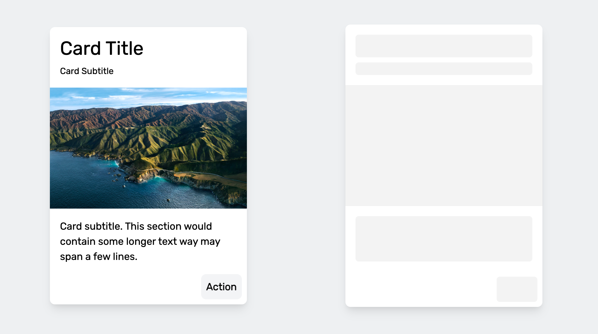

# auto-skelly

Framework-agnostic skeleton loading placeholders, generated automatically from your existing markup.

[](https://www.npmjs.com/package/auto-skelly)
[](https://github.com/AlexGordienko/Auto-Skelly/actions/workflows/ci.yml)
[](./LICENSE)



**[Live demo →](https://auto-skelly.alexgordienko.com)**

## Why

Users perceive pages as faster when something meaningful appears immediately, even before real data has arrived. Skeleton screens — animated placeholders shaped like the content that's loading — reduce perceived latency and avoid the layout jank of spinners or blank space. Auto Skelly generates those placeholders directly from your markup, so you don't hand-build a skeleton for every view.

## Install

```bash
npm i auto-skelly
```

Or drop it in with a script tag — `data-skelly-auto` skellifies the page automatically on `DOMContentLoaded`:

```html
<script src="https://unpkg.com/auto-skelly" data-skelly-auto></script>
```

## Quick start

```html
<div class="skelly-text">Order #1204 — Delivered</div>

<button class="skelly-button">View details</button>

<script type="module">
  import { AutoSkelly } from "auto-skelly";

  const skelly = new AutoSkelly();
  skelly.apply();

  fetchOrder().then(() => {
    skelly.remove(); // originals reappear exactly as they were
  });
</script>
```

Originals are hidden, not destroyed — `remove()` brings back the real content untouched.

## API reference

### `new AutoSkelly(options?)`

| Option | Type | Default | Description |
| --- | --- | --- | --- |
| `color` | `string` | `"#e3e3e3"` | Placeholder background color. |
| `animation` | `"pulse" \| "extraPulse" \| "gradient" \| "none"` | `"pulse"` | Placeholder animation. |
| `root` | `ParentNode` | `document` | Root to search/restore within by default. |

### Methods

- **`apply(root?: ParentNode): void`** — Finds `.skelly-*` elements under `root` (default: the instance's configured root, or `document`), replaces each with a sized placeholder, and hides the original in place.
- **`remove(root?: ParentNode): void`** — Restores original elements and removes their placeholders. Pass `root` to restore only elements contained within it; omit it to restore everything this instance currently has applied.
- **`setTheme(theme: { color?: string; animation?: SkellyAnimation }): void`** — Updates color and/or animation on every placeholder this instance currently has applied.
- **`active`** — Read-only getter, `true` while this instance has one or more applied placeholders.

### Shape classes

- **`.skelly-text`** — a bar sized to the measured line-height; content taller than two line-heights becomes stacked bars, with a shorter final line.
- **`.skelly-image`** — a rectangle sized to the element, falling back to an ``'s `width`/`height` attributes, then a 16:9 aspect ratio.
- **`.skelly-circle`** — a circle sized to the larger of the element's measured width/height.
- **`.skelly-button`** — a rectangle sized to the element's outer width/height.

Sizing also copies each element's computed `border-radius` (falling back to `5px` for text/buttons, `50%` for circles, `0` for images) and margins.

## Theming

Three ways to control appearance, in increasing order of granularity:

1. **Constructor options** — set `color`/`animation` once, at construction.
2. **`setTheme({ color?, animation? })`** — change color/animation on an already-applied instance; every visible placeholder updates immediately.
3. **CSS custom properties** — set `--skelly-color` and `--skelly-duration` on any ancestor (or `:root`) to override color and animation speed without touching JS.

Animations:

- `pulse` (default) — opacity fade.
- `extraPulse` — scale + box-shadow pulse.
- `gradient` — animated diagonal gradient sweep.
- `none` — static placeholder, no animation.

## Framework recipes

### React

```jsx
import { useEffect, useRef } from "react";
import { AutoSkelly } from "auto-skelly";

function OrderCard({ isLoading, children }) {
  const rootRef = useRef(null);
  const skelly = useRef(new AutoSkelly());

  useEffect(() => {
    if (isLoading) skelly.current.apply(rootRef.current);
    else skelly.current.remove(rootRef.current);
  }, [isLoading]);

  return <div ref={rootRef}>{children}</div>;
}
```

### Vue 3

```vue
<script setup>
import { ref, onMounted, watchEffect } from "vue";
import { AutoSkelly } from "auto-skelly";

const rootEl = ref(null);
const isLoading = ref(true);
const skelly = new AutoSkelly();

onMounted(() => {
  watchEffect(() => {
    isLoading.value ? skelly.apply(rootEl.value) : skelly.remove(rootEl.value);
  });
});
</script>

<template><div ref="rootEl"><!-- skelly-* markup --></div></template>
```

### Plain script tag

```html
<!-- Auto-applies on DOMContentLoaded -->
<script src="https://unpkg.com/auto-skelly" data-skelly-auto></script>
```

Without `data-skelly-auto`, the script still exposes `window.AutoSkelly` for manual control:

```html
<script src="https://unpkg.com/auto-skelly"></script>
<script>new window.AutoSkelly().apply();</script>
```

## Accessibility

- Placeholders are marked `aria-hidden="true"`.
- The parent of any skellified element gets `aria-busy="true"` for as long as it has active children, cleared automatically once they're all restored.
- Animations only run under `prefers-reduced-motion: no-preference`; placeholders render static otherwise.

## Migrating from v0

v0 was a jQuery-based, unpublished prototype distributed by copying `autoskelly.js`/`autoskelly.css` into your project. v1 is a zero-dependency TypeScript rewrite published to npm.

| v0 | v1 |
| --- | --- |
| `setSkelly(color, animation)` | `new AutoSkelly({ color, animation }).apply()` |
| `changeSkellyColor(color)` | `setTheme({ color })` |
| `changeSkellyAnimation("standard")` | `setTheme({ animation: "pulse" })` |
| `changeSkellyAnimation("bigPulse")` | `setTheme({ animation: "extraPulse" })` |
| `activateSkelly(true)` / `activateSkelly(false)` | `apply()` / `remove()` |

The most important behavioral change: v0 permanently destroyed skellified elements via jQuery's `replaceWith`. v1 hides originals and restores them exactly on `remove()` — skellification is now reversible.

## Contributing

See [CONTRIBUTING.md](./CONTRIBUTING.md).

## License

[MIT](./LICENSE) © Alex Gordienko
